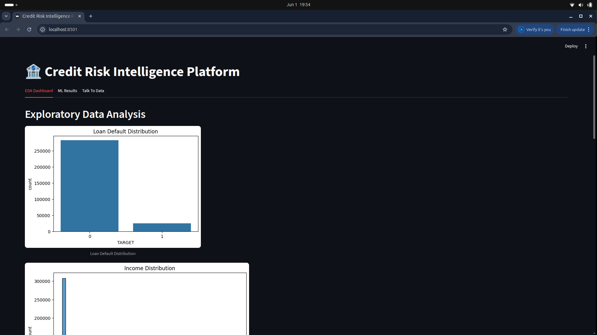
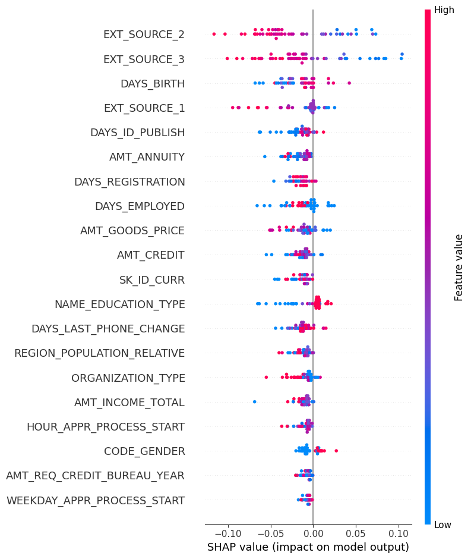
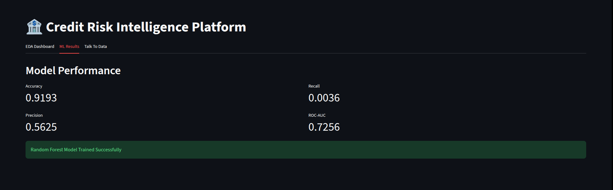
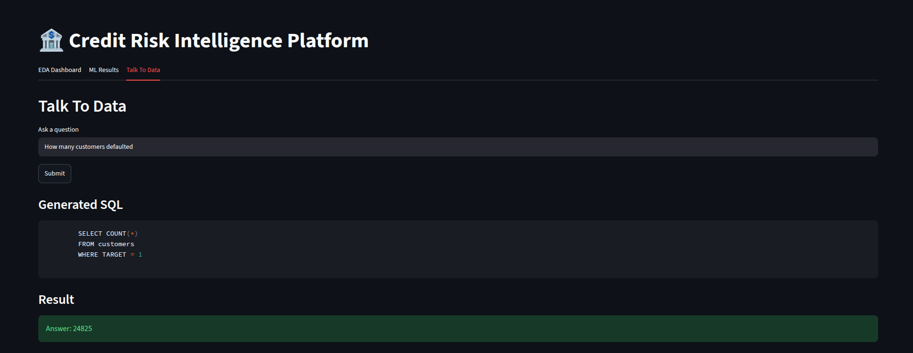
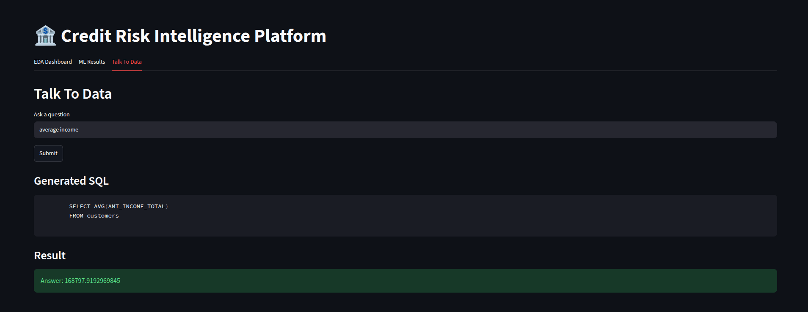

# 🏦 Credit Risk Intelligence Platform

An end-to-end AI-powered Credit Risk Intelligence Platform built using Machine Learning, Explainable AI (SHAP), Natural Language to SQL, Streamlit, SQLite, and Docker.

The platform analyzes customer credit data, predicts loan default risk, provides explainable insights, and enables business users to interact with data using natural language queries.

---

# 🚀 Features

## 📊 Exploratory Data Analysis (EDA)

- Dataset overview and feature categorization
- Missing value analysis
- Business insights generation
- Visualizations:
  - Loan Default Distribution
  - Income Distribution
  - Credit Distribution
  - Gender Distribution
  - Education Distribution
  - Correlation Heatmap

---

## 🤖 Machine Learning Layer

### Data Processing

- Missing value handling
- Feature encoding
- Data cleaning pipeline
- Feature preparation for machine learning

### Model

- Random Forest Classifier
- Class imbalance handling using `class_weight='balanced'`

### Model Performance

| Metric | Value |
|----------|----------|
| Accuracy | 0.9193 |
| Precision | 0.5625 |
| Recall | 0.0036 |
| F1 Score | 0.0072 |
| ROC-AUC | 0.7256 |

---

## 🔍 Explainable AI

SHAP (SHapley Additive exPlanations) was used to interpret model predictions and identify the most influential features affecting loan default risk.

### Top Influential Features

- EXT_SOURCE_2
- EXT_SOURCE_3
- DAYS_BIRTH
- EXT_SOURCE_1
- DAYS_ID_PUBLISH
- AMT_ANNUITY
- DAYS_REGISTRATION
- DAYS_EMPLOYED
- AMT_CREDIT
- AMT_GOODS_PRICE

---

## 💬 Talk To Data (NL → SQL)

The platform supports Natural Language to SQL conversion using SQLite.

### Supported Questions

#### Example 1

**Question**

```text
How many customers defaulted?
```

**Generated SQL**

```sql
SELECT COUNT(*)
FROM customers
WHERE TARGET = 1;
```

**Result**

```text
24825
```

---

#### Example 2

**Question**

```text
average income
```

**Result**

```text
168797.92
```

---

#### Example 3

**Question**

```text
average credit amount
```

**Result**

```text
599026.00
```

---

#### Example 4

**Question**

```text
default rate
```

**Result**

```text
8.07%
```

---

#### Example 5

**Question**

```text
most common education type
```

**Result**

```text
Secondary / secondary special
```

---

## 🌐 Streamlit Dashboard

The application provides a unified user interface containing:

- EDA Dashboard
- ML Results Dashboard
- SHAP Explainability Dashboard
- Talk To Data Chatbot

---

# 🏗️ Project Architecture

```text
User
 │
 ▼
Streamlit UI
 │
 ├── EDA Dashboard
 │
 ├── ML Layer
 │      │
 │      ▼
 │   Random Forest Model
 │
 ├── SHAP Explainability
 │
 └── NL → SQL Chatbot
         │
         ▼
      SQLite Database
```

---

# 📂 Project Structure

```text
credit-risk-intelligence-platform/

├── charts/
│   ├── default_distribution.png
│   ├── income_distribution.png
│   ├── credit_distribution.png
│   └── shap_summary.png
│
├── data/
│
├── documents/
│   └── screenshots/
│
├── notebooks/
│   └── eda.py
│
├── src/
│   ├── data/
│   │   ├── loader.py
│   │   ├── preprocessor.py
│   │   └── test_preprocessing.py
│   │
│   ├── ml/
│   │   ├── train.py
│   │   ├── evaluate.py
│   │   └── explain.py
│   │
│   ├── talk_to_data/
│   │   ├── nl_to_sql.py
│   │   ├── query_runner.py
│   │   ├── prompt_templates.py
│   │   └── test_chatbot.py
│   │
│   └── utils/
│
├── sql/
│   ├── create_db.py
│   └── schema.sql
│
├── Dockerfile
├── docker-compose.yml
├── app.py
├── requirements.txt
├── .env.example
└── README.md
```

---

# 📈 Dataset

### Dataset Used

**Home Credit Default Risk Dataset**

Source:

https://www.kaggle.com/competitions/home-credit-default-risk

### Required Files

```text
application_train.csv
application_test.csv
```

Place them inside:

```text
data/
├── application_train.csv
└── application_test.csv
```

---

# ⚙️ Installation

## Clone the Repository

```bash
git clone https://github.com/Advaid12/credit-risk-intelligence-platform.git

cd credit-risk-intelligence-platform
```

## Create a Virtual Environment

```bash
python3 -m venv venv
```

## Activate the Virtual Environment

### Linux / macOS

```bash
source venv/bin/activate
```

### Windows

```bash
venv\Scripts\activate
```

## Install Dependencies

```bash
pip install -r requirements.txt
```

## Download Dataset

Download the Home Credit Default Risk dataset from Kaggle:

https://www.kaggle.com/competitions/home-credit-default-risk

Place:

```text
application_train.csv
application_test.csv
```

inside:

```text
data/
```

---

# ▶️ Running the Project

## Create SQLite Database

```bash
python sql/create_db.py
```

## Train Machine Learning Model

```bash
python src/ml/train.py
```

## Generate SHAP Explainability

```bash
python src/ml/explain.py
```

## Launch Streamlit Dashboard

```bash
streamlit run app.py
```

Open:

```text
http://localhost:8501
```

---

# 🐳 Docker

## Build Docker Image

```bash
docker build -t credit-risk-platform .
```

## Run Docker Container

```bash
docker run -p 8501:8501 credit-risk-platform
```

Access the application:

```text
http://localhost:8501
```

---

# 📸 Screenshots

## EDA Dashboard



## SHAP Explainability



## ML Results



## Chatbot Example



## Average Income Query



---

# 🔮 Future Improvements

- XGBoost / LightGBM implementation
- SMOTE-based imbalance handling
- Dynamic LLM-powered NL → SQL generation
- Real-time model monitoring
- Advanced customer risk segmentation
- Cloud deployment (AWS/Azure/GCP)
- Real-time prediction APIs

---

# 👨‍💻 Author

**Advaith Manoj**

B.Tech Computer Science & Engineering

NeoStats AI Engineering Assignment

Credit Risk Intelligence Platform